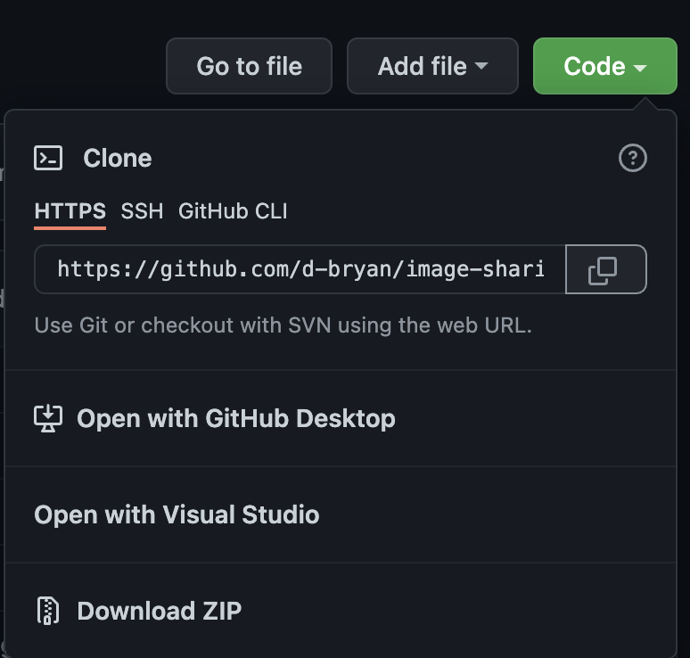
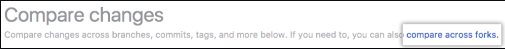

# Contributing Guidelines

Follow these requirements for contributing to the repository. If we need to consistently rebase your code, I will have you send me it to manually review and will push it myself.

- [Contributing Guidelines](#contributing-guidelines)
  - [Basics Review](#basics-review)
  - [Fork the Repository](#fork-the-repository)
  - [Cloning The Repository](#cloning-the-repository)
  - [Checkout Your Teams Branch](#checkout-your-teams-branch)
    - [Add Remote For Organization Repository](#add-remote-for-organization-repository)
  - [Fetch and Pull](#fetch-and-pull)
  - [Make Edits](#make-edits)
  - [Stage and Commit](#stage-and-commit)
  - [Make a Pull Request](#make-a-pull-request)
    - [Important](#important)
    - [Example](#example)
  - [Reviewing a Pull Request](#reviewing-a-pull-request)

## Basics Review

If you need a quick review on how to use the terminal or wish to learn more about how GitHub works watch this [video](https://www.youtube.com/watch?v=IRuPHS1hukI)

## Fork The Repository

Fork the original repository to your local GitHub, this way you can make edits and push the code there. To do this
you will need to do the following:

You will then need to go to your local account and clone the repository.

## Cloning The Repository

Clone the repository into your preferred directory

`git clone YOUR_ACCOUNT_URL` -> EX: git clone `https://github.com/d-bryan/image-sharing-app.git`

change directories into the cloned repository

`cd image-sharing-app`

install all the dependencies

`npm install`

### Add Remote for Organization Repository

Setup the link to the organization reposiotry by running the following command:

`git remote add upstream https://github.com/umgc-cmsc-495-group-1/image-sharing-app.git`

`git remote add origin https://github.com/[YOUR USERNAME HERE]/image-sharing-app.git`

## Fetch and Pull

If you are working on a feature that has yet to be added to the repository, then you need to only check and see what has been updated. You can run a few commands to see this.

`git status` will tell you how far behind or ahead of the master branch you are.

`git log` will show you all the commits, merge, and pull requests to the branch, and who made them. There is also a SHA hashed string that you can look up through the repository to locate the exact item.

If you need to update your local branch after the master has had updates then run the following items. Just ensure that you are in your local branch before doing so - `git checkout TEAM`

`git fetch upstream TEAM`

`git pull upstream TEAM`

If someone has helped you out with something in your branch, then pushed code to your repository and you need to update your local branch, you can run the following commands. Same concept applies, ensure you are in your branch by running the checkout command above.

`git fetch origin TEAM`

`git pull origin TEAM`

where `TEAM` is your team name

At no point should anyone be working in the master branch, if you run the command `git branch` and it has the asterisk `*` next to the word master -> `* master`, you need to switch to your feature branch (your team).

The goal is to have everyone work on their own branch, and push the work to the repository, then merge into master once it passes the tests.

## Make Edits

Make any necessary edits to the documents that you think should be contributed

## Stage and Commit

`npm run fix-errors`

`git add .`

`git commit -m "ENTER YOUR CHANGES HERE"`

`git push -u origin TEAM`

<b><u>The -u is important</u></b> we want individuals to have their upstream branch se to their respective,
teams this way we do not run into merge conflicts on the master branch.

You will on have to do this the first time, then moving forward you can just do the following `git push origin TEAM`

## Make a Pull Request

Go to your local GitHub repository for the application and make a pull request.

### Important

Never merge or make a pull request to the master branch, this is our default branch and used to restore from. All of our code will eventually be added to the master branch.

The process will be features added to individual teams, merged into the development branch to check for breaking changes, then committing to master.

### Example

Upon making changes for the team you are working for, click the pull requests tab under `image-sharing-app` in our organization.

On the compare page, click `compare across forks`

When comparing changes, the `base repository` will say `umgc-cmsc-495-group-1/image-sharing-app`. The base should be whatever team you are on, never `master` or `dev`.

For example - If you are on the data team then it would look like the following:
`base repository: umgc-cmsc-495-group-1/image-sharing-app` `base: data`

In the `head fork` drop-down, select the branch you made your changes in. Using the previous example,
if you are on the data team, this would be data.

Add a title for your Pull Request and any major comments for the updates you made in the body.

Finalize your pull request and mark it ready for review.

## Reviewing a Pull Request

<b><u>Remember Not to delete the branch</u></b> When you review the pull request, we need to keep commit history for tracking work.
